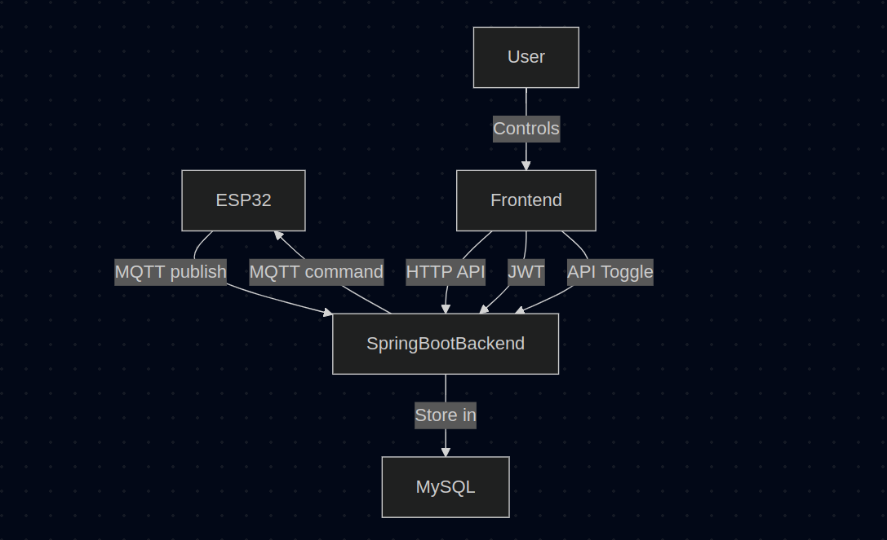

# PBL25-5-GreenHouseClime
# Smart Environmental Control System with ESP32, Spring Boot, and Web Dashboard

This project is a full-stack IoT system for environmental monitoring and actuator control using an ESP32 microcontroller, real-time sensor data collection, a Spring Boot backend, and an interactive HTML+JS frontend.

---

## 📦 Project Overview

### ✨ Features
- Real-time monitoring of **humidity**, **temperature**, and **light levels**
- Remote control of:
  - 🔄 Linear actuator motor (via 2 relays)
  - 🌬️ DC fan
  - 💡 LED
- Sensor data stored in a **MySQL** database
- RESTful API built with **Spring Boot**
- Frontend with:
  - 📈 Historical charts using Chart.js
  - 🟢 Live status indicators
  - 🔘 Control buttons for actuators
- Secure login with **JWT authentication**

---

## 🔌 Hardware Setup (ESP32)

### Components
- ESP32 Dev Board
- 4-Channel Relay Module
- DHT11 Sensor (humidity + temperature)
- Light Sensor (e.g. LDR or module)
- Linear Actuator (12V, 2-relay control)
- DC Fan (12V)
- LED with 220Ω resistor
- 12V Power Supply

### Wiring Summary

#### Relays (controlled by ESP32)
| Device            | ESP32 Pin | Relay Channel |
|------------------|-----------|---------------|
| Linear Motor A    | GPIO27    | Relay 1       |
| Linear Motor B    | GPIO33    | Relay 2       |
| DC Fan           | GPIO2    | Relay 3       |
| LED              | GPIO16    | Relay 4       |

#### Sensors
- **DHT11**: Connected to GPIO23
- **Light Sensor**: Connected to GPIO18

#### Power
- All relays and actuators powered from 12V supply
- ESP32 powered via USB or buck converter
- **Common Ground** shared between 12V supply and ESP32

> **Important:** Do not activate both motor relays at once. Control motor direction by toggling one at a time.

---

## ⚙️ Backend Setup (Spring Boot + MySQL)

### Features
- MQTT listener for data from ESP32
- REST API for frontend to:
  - Get latest sensor values
  - Fetch historical data for charts
  - Toggle actuators via API calls
- JWT-based user authentication
- MySQL for persistent data storage

### Setup Steps
1. Create `.env` file:
   ```properties
    MYSQL_URL=
    MYSQL_USERNAME=
    MYSQL_PASSWORD=
    JWT_SECRET_KEY=
    JWT_EXPIRATION_TIME=3600000000
    
    AWS_IOT_ENDPOINT=
    AWS_IOT_CERTIFICATE_PATH=./aws-iot-files/device_cert.crt
    AWS_IOT_PRIVATE_KEY_PATH=./aws-iot-files/private.key
    AWS_IOT_CA_CERT_PATH=./aws-iot-files/AmazonRootCA1.pem
    AWS_IOT_CLIENT_ID=greenhouse-1
    AWS_IOT_THING_NAME=
    AWS_IOT_TOPIC_PREFIX=greenhouse


2. Run with Maven or your IDE:

   ```bash
   mvn spring-boot:run
   ```

3. Backend listens to sensor data via MQTT and provides APIs for frontend.

---

## 🌐 Frontend Overview

### Tech Stack

* Pure HTML + JavaScript
* Chart.js for data visualization
* Fetch API for communication with backend
* JWT login system

### Features

* 📊 Charts for temperature, humidity, and light over time
* 🔘 Buttons to toggle:

    * Linear Motor (Forward/Reverse)
    * Fan ON/OFF
    * LED ON/OFF
* 🟢 Real-time status indicators
* 🔐 Login & logout functionality (JWT stored in browser)

---

## 📡 Communication Flow



---

## 🛠️ Running the System

1. **Power your hardware**
2. **Flash ESP32 firmware**
3. **Start Spring Boot server**
4. **Serve `index.html` frontend in browser**
5. **Log in and interact with the system!**

---

## 📜 License

MIT License. Free to use and modify.

---

## 👨‍💻 Author

Created by team 5 FAF-223
Bujilov Dmitrii
Ciornii Alexandr
Cravcenco Dmitrii
Nedealcova Irina


